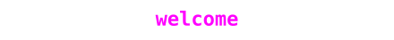

  

  &nbsp;&nbsp;building · voidwalk (C++20 binary analysis tool) 
  &nbsp;&nbsp;learning · htb, rust 
  &nbsp;&nbsp;reach me · <a href="mailto:contact@mnaomii.com">contact@mnaomii.com</a> 

  
  
  
  
  
  
  

  

